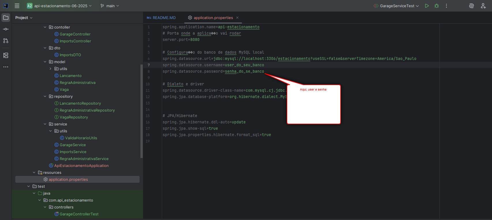
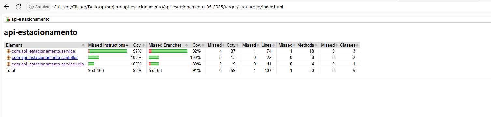

# Projeto API-ESTACIONAMENTO:

## O que ele usa?
OPEN JDK 17  
MAVEN  
MYSQL   
### Para rodar: 
Por no properties os dados de login do seu mysql local  
Também irá rodar esse comando nele:  

<pre> CREATE DATABASE estacionamento CHARACTER SET utf8mb4 COLLATE utf8mb4_general_ci;  </pre>
Irá criar o banco de dados

Então você deve clonar o repo, ao abrir em sua IDE use o JDK apropiado.  
Não esqueça de setar o maven adequadamente na sua IDE.

No arquivo propertie devera setar os dados do seu banco:

Então vc pode iniciar a API, ela vai rodar na 8080.
Seu Swagger é neste endereço: http://localhost:8080/swagger-ui.html <pre>
Então você vai primeiro importar os dados para inicialização.  
Abaixo o json para usar pelo swagger:
<pre>
{
"vagas": [
{ "status": "LIVRE", "geolocalizacao": "aqui a geolocalização" },
{ "status": "LIVRE", "geolocalizacao": "aqui a geolocalização" },
{ "status": "LIVRE", "geolocalizacao": "aqui a geolocalização" },
{ "status": "LIVRE", "geolocalizacao": "aqui a geolocalização" },
{ "status": "LIVRE", "geolocalizacao": "aqui a geolocalização" },
{ "status": "LIVRE", "geolocalizacao": "aqui a geolocalização" },
{ "status": "LIVRE", "geolocalizacao": "aqui a geolocalização" },
{ "status": "LIVRE", "geolocalizacao": "aqui a geolocalização" }
],
"regras": [
{
"status": "Ativa",
"horaEntrada": "06:00:00",
"horaSaida": "22:00:00"
}
]
}
</pre>
  
### Abaixo seguem exemplos para as funcionalidades:

#### ABRE OU FECHA A GARAGEM:
[PUT] http://localhost:8080/garage

Não tem a necessidade de um corpo.

#### ENTRADA DE CARRO
[POST] Basta preencher os campos

Um curl ficaria assim:
<pre>

curl -X POST http://localhost:8080/garage \
  -H "Content-Type: application/json" \
  -d '{
    "idVaga": 1,
    "entrada": "2025-06-07T08:30:00",
    "tarifa": 10.00
  }'

</pre>

#### SAIDA DE CARRO
[PATCH]

Os GETS são bastante intuitivos.
Um lista todas as vagas o outro só uma vaga.

Aqui tem um SQL especifico que vc pode usar no MySQL-Workbench para testar a parte da validação do estacionamento cheio:
<pre>
USE estacionamento;

UPDATE vaga
SET status = 'EM_USO'
where 1=1;
</pre>

Talvez vc precise desabilitar o "somente updates seguros". [/br]
Pra isso vc pode ir em Edit/Preferences - reinicie a sessão.

### TESTES
Basta rodar o msn clean install e ele rodará.

O Jacoco, relatório de cobertura:

